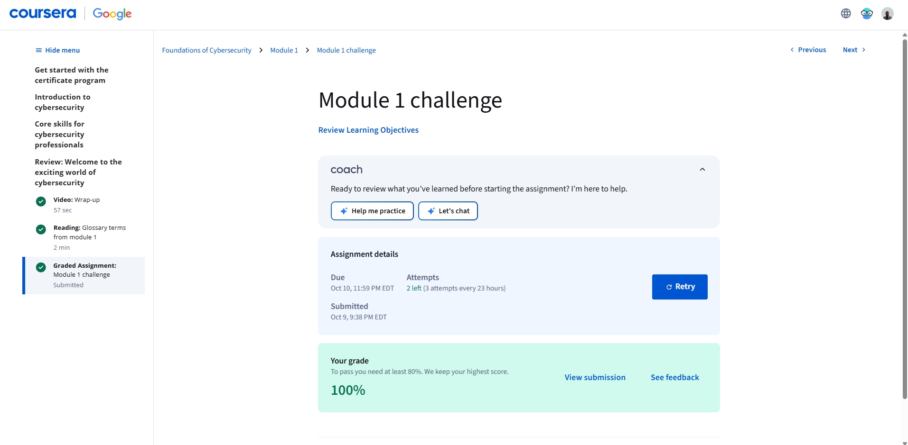

# SOC-Analyst-Journey

My journey to becoming a Security Operations Center (SOC) Analyst through the Google Cybersecurity Certificate — documenting hands‑on labs, notes, reflections, videos, and proofs of completion.

## 📚 Google Cybersecurity Certificate Progress

- **Module 1 – Foundations of Cybersecurity**  
  Folder: `Google-Cybersecurity-Certificate/Module1_Foundations_of_Cybersecurity/`  
  - Summary & notes are in that folder's `README.md`  
  - Proof of completion:  
    

## 🗂️ Structure
```
/ (repo root)
├── README.md  ← (this file)
└── Google-Cybersecurity-Certificate/
    ├── Module1_Foundations_of_Cybersecurity/
    │   ├── README.md
    │   ├── Spot_the_Phish_Summary.md
    │   ├── Module1_Challenge_Reflection.md
    │   └── Key_Terms_Glossary.md
    └── certificates/
        └── Module1_Challenge_Completion.png
```

> If you reorganize folders, update image paths accordingly or use a direct URL with `?raw=true`.
