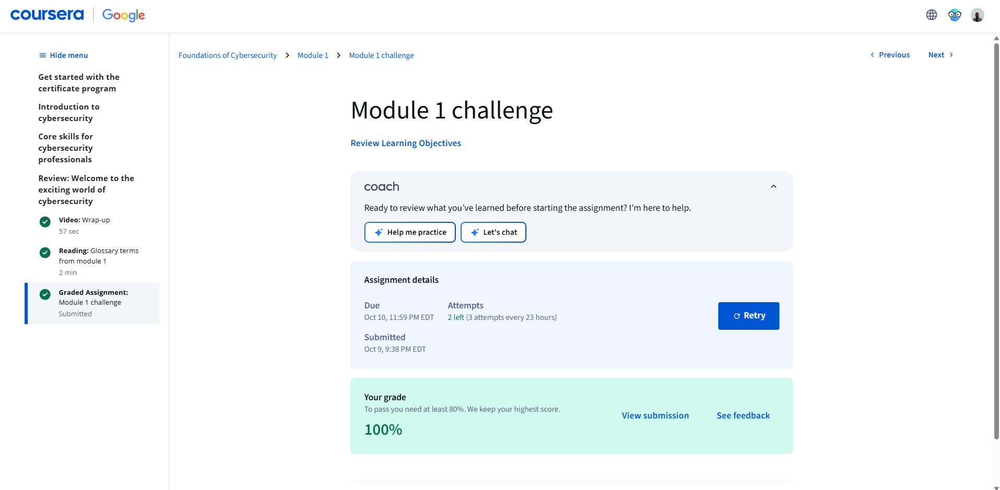

# 🛡️ SOC-Analyst-Journey  
*Building the foundation for a career in cybersecurity and Security Operations (SOC) analysis.*

---

## 👋 About This Repository

This repository documents my full learning path toward becoming a **Security Operations Center (SOC) Analyst**, starting with the **Google Cybersecurity Professional Certificate**.  
It includes my notes, reflections, hands-on labs, and proof of completion for each course module — showing my growth from foundational theory to real-world technical skills.

> *“Cybersecurity isn’t just about defending systems — it’s about protecting people, data, and trust.”*

---

## 🧭 Roadmap of Learning

| Stage | Focus Area | Status |
|-------|-------------|--------|
| **Module 1:** Foundations of Cybersecurity | Key terminology, compliance, and SOC overview | ✅ Complete |
| **Module 2:** Manage Security Risks | Risk assessment & security frameworks | 🔜 Upcoming |
| **Module 3:** Networks and Network Security | Network defense & intrusion detection | 🔜 Upcoming |
| **Module 4:** Linux and SQL | Hands-on commands & query skills | 🔜 Upcoming |
| **Module 5:** Assets, Threats, and Vulnerabilities | Threat modeling & asset classification | 🔜 Upcoming |
| **Module 6:** Detection and Response | SIEM & incident response playbooks | 🔜 Upcoming |
| **Module 7:** Python Automation | Automating security workflows | 🔜 Upcoming |
| **Module 8–9:** Job Prep & AI Tools | Portfolio building & professional readiness | 🔜 Upcoming |

---

## 📘 Google Cybersecurity Certificate Work

### [🔗 Module 1 – Foundations of Cybersecurity](./Google-Cybersecurity-Certificate/Module1_Foundations_of_Cybersecurity)

- Overview of cybersecurity fundamentals  
- Practice exercises such as *Spot the Phish*  
- Reflection on transferable and technical skills  
- Proof of 100 % completion  

📄 **Preview:**  

---

## ⚙️ Skills & Tools Developed

| Category | Examples |
|-----------|-----------|
| **Security Foundations** | CIA Triad • Threat Actors • Internal/External Risks |
| **Compliance & Frameworks** | NIST CSF • ISO 27001 • HIPAA • GDPR |
| **Technical Tools** | SIEM (Splunk / Chronicle) • IDS/IPS • Wireshark |
| **Programming** | Python • SQL • Automation Scripts |
| **Analyst Skills** | Incident Response • Risk Assessment • Security Audits |
| **Soft Skills** | Communication • Problem-Solving • Collaboration • Growth Mindset |

---

## 🧠 Vision & Next Steps

This repository will evolve as I progress through each module and complete more hands-on labs and demos.  
Future updates will include:
- 🎬 Short video walkthroughs (linked from YouTube)  
- 🧾 Incident response simulations  
- 🧰 Python scripts for automation and log analysis  
- 📈 SOC use-case reports  

---

## 🙌 Connect & Collaboration

If you’re also pursuing cybersecurity or building SOC projects, feel free to connect and collaborate!

- 🧑‍💻 **GitHub:** [Aromich-25](https://github.com/Aromich-25)
- 💼 **LinkedIn:** [Aron Michaels](https://www.linkedin.com/in/aron-michaels/)
- 🎥 **YouTube (Faithful Cyber):** [@FaithfulCyber](https://www.youtube.com/@FaithfulCyber)
- 🌐 **Linktree:** [linktr.ee/michaelsaron](https://linktr.ee/michaelsaron)

> *Every click, connection, and configuration matters.*
